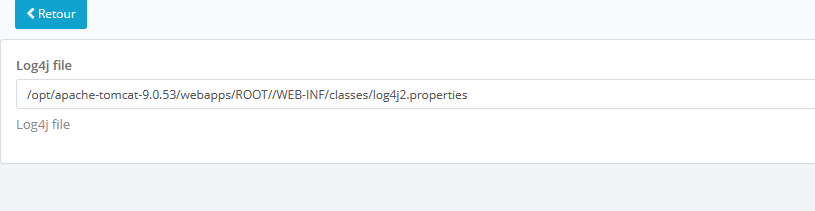
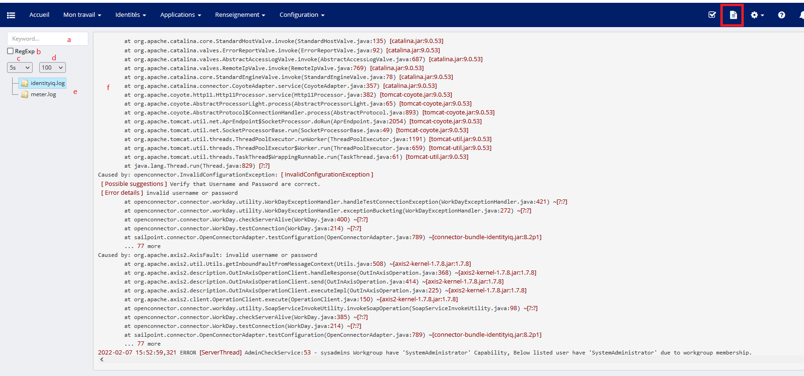
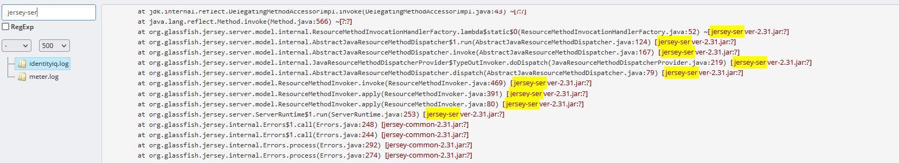

# IIQ-LogsTail

LogsTail is an IdentityIQ plugin that allows viewing logs files of a single server.

## Installation

1. Import the plugin
2. Configure the log4j file path

## Usage

Click on the file upper right icon screen

  1. A search input allows you to perform a search on the current viewed log file data
  2. Check if you want to perform search with regexp
  3. Allow setting the refresh frequency
  4. Allow setting the number of lines to view (from the end)
  5. Log file list (mouse over to show the full file path)
  6. Log file data

Search highlight

Note: 
Currently the plugin does not support multiservers architecture, it returns logs of the current execution server.
